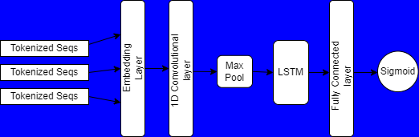

# Neural Network Modeling for Transcription Factor Binding Site Prediction

Brief description about the approach of the project, design of the model and certain results.

**1. Data Preprocessing and Transformation:**
    
    - Imported and processed ChIP-Seq, DeepGenBind, and dream5 datasets using pandas.
    - Conducted data cleaning and division into 80% training and 20% testing sets.
    - Utilized tokenization and zero-padding with Keras/TensorFlow for numerical representation.
    
**2. Model Development and Enhancement:**
    
    - Designed and implemented three distinct neural network models.
    - Explored model complexity by adding layers for improved performance.
    - Recreated the DeepGenBind model and achieved an 82% accuracy.
    
**3. Model Performance Validation:**
    
    - Evaluated model accuracy, achieving a validation accuracy of approximately 80%.
    - Demonstrated consistency with the performance of the original DeepGenBind model within the dataset.

## Model designs

